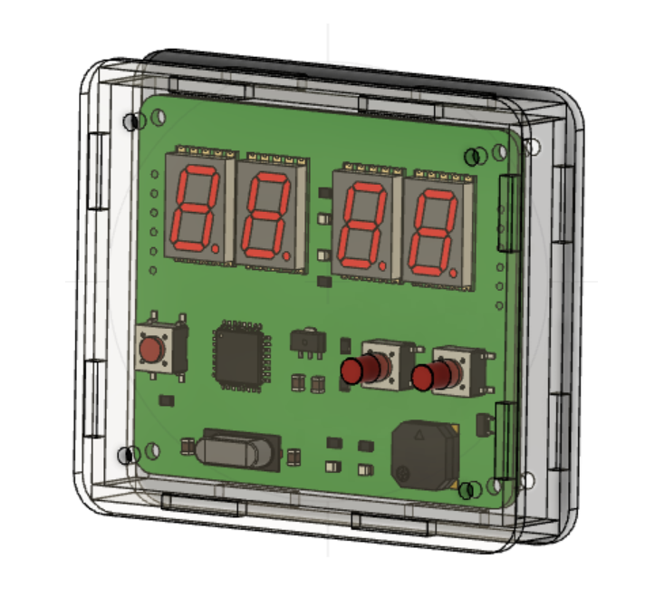
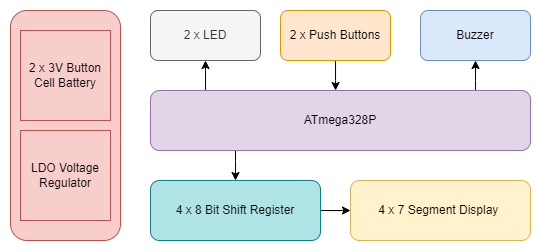

# Pomodoro Timer

A Pomodoro timer helps you focus on a task for 25 minutes and then take a 5-minute break

## 5 steps of the Pomodoro technique
1. Choose a task
2. Set the timer for 25 minutes
3. Work on the task until the timer rings
4. Take a 5-minute break
5. Repeat steps 1-4 three more times

## 3D Render: PCB + Enclosure

## Hardware block diagram

| Component | Function |
|--|--|
| ATmega328P            | Micro-controller that controls all functionality                  |
| LED                   | Indicate the status of the Pomodoro timer                         |
| Push buttons          | Provide an interface to start/stop and reset the Pomodoro timer   |
| Buzzer                | Provide auditory feedback upon completion of the timer            |
| 4x7 segment display   | Displays remaining time for the Pomodoro session                  |
| LDO voltage regulator | Efficiently regulates the voltage supplied to the embedded system |
| Cell battery          | Provides power to the entire system                               |

### Made with lots of ⏱️, 📚 and ☕ by InputBlackBoxOutput
